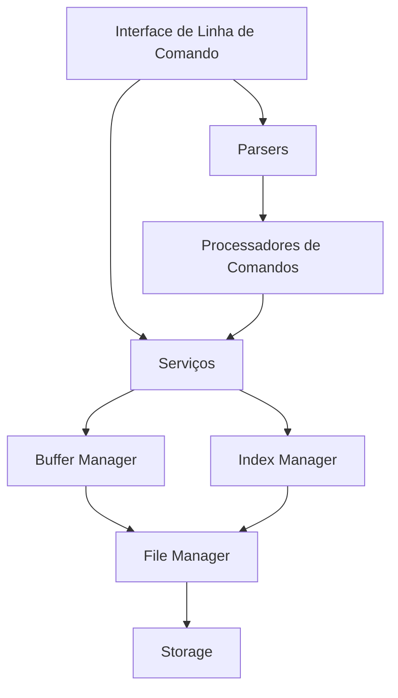
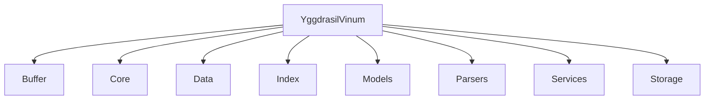
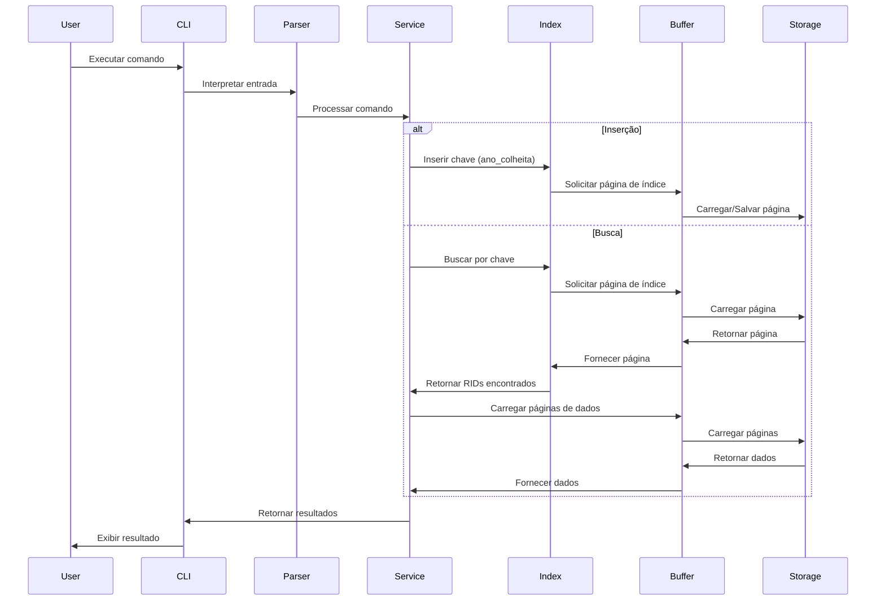
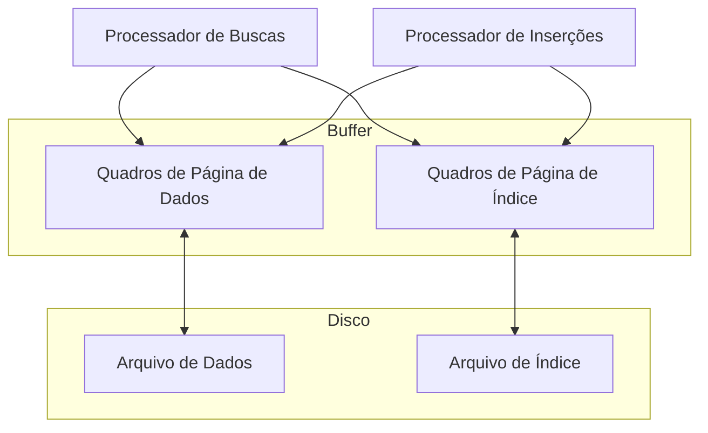
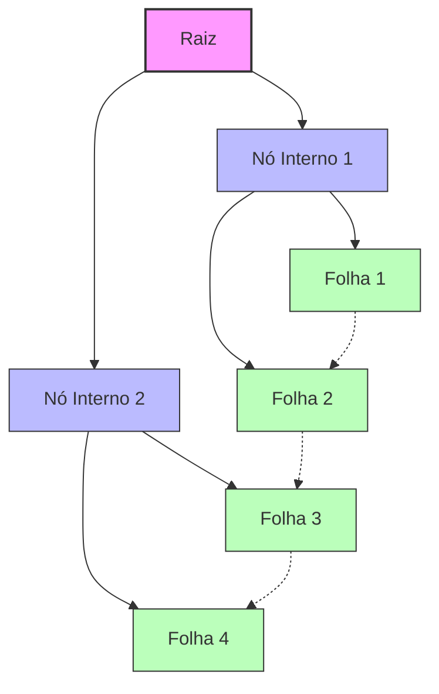
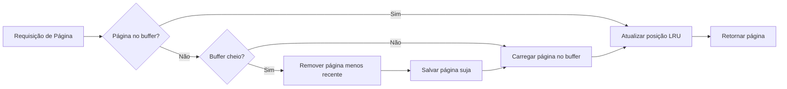
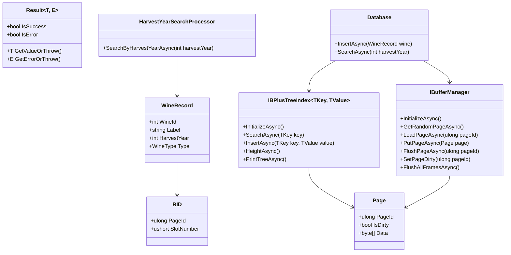
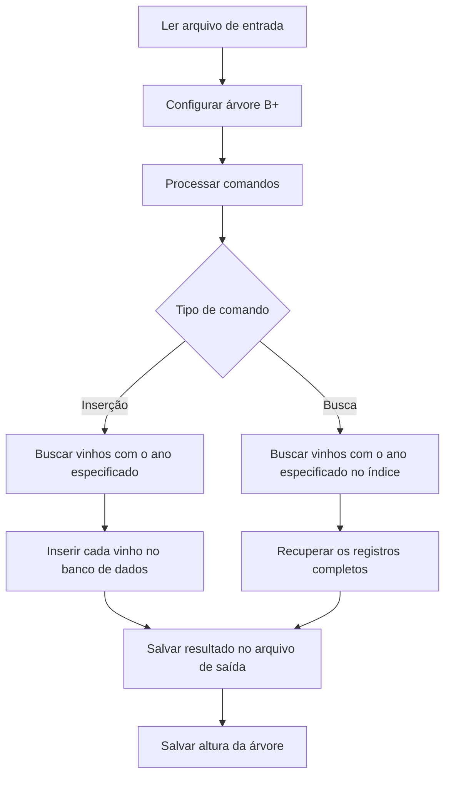
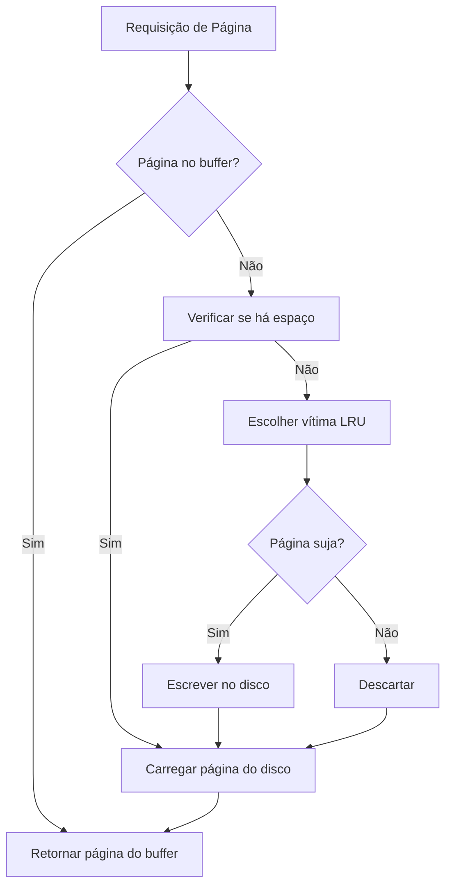

# YggdrasilVinum - Sistema de Gerenciamento de Dados de Vinhos

## Sumário

1. [Introdução](#introdução)
2. [Visão Geral](#visão-geral)
3. [Arquitetura](#arquitetura)
4. [Componentes Principais](#componentes-principais)
5. [Fluxo de Dados](#fluxo-de-dados)
6. [Estrutura de Armazenamento](#estrutura-de-armazenamento)
7. [Algoritmos Implementados](#algoritmos-implementados)
8. [Diagrama de Classes](#diagrama-de-classes)
9. [Processamento de Comandos](#processamento-de-comandos)
10. [Gerenciamento de Buffer](#gerenciamento-de-buffer)
11. [Requisitos Técnicos](#requisitos-técnicos)
12. [Executando o Projeto](#executando-o-projeto)
13. [Usando Docker](#usando-docker)
14. [Formatação de Código](#formatação-de-código)
15. [Testes](#testes)

## Introdução

YggdrasilVinum é uma aplicação .NET projetada para gerenciar e analisar dados de vinhos, implementando uma estrutura de índice de árvore B+ para armazenamento e consulta eficientes. O sistema permite inserções e buscas por igualdade em registros de vinhos com base no ano de colheita.

## Visão Geral

O projeto YggdrasilVinum foi desenvolvido como uma implementação de um sistema de gerenciamento de banco de dados simplificado, focado na indexação eficiente utilizando árvores B+. A aplicação lida com dados de vinhos armazenados em arquivos CSV, processando-os em um sistema de armazenamento em disco com buffer limitado.

## Arquitetura

YggdrasilVinum segue uma arquitetura em camadas com separação clara de responsabilidades:



## Componentes Principais

### Estrutura do Projeto



### Componentes Funcionais

| Componente | Responsabilidade                                                     |
| ---------- | -------------------------------------------------------------------- |
| Buffer     | Gerencia buffers limitados de memória para páginas de dados e índice |
| Core       | Contém as classes principais e fábricas da aplicação                 |
| Data       | Armazena os dados brutos de vinhos                                   |
| Index      | Implementa a estrutura de dados de árvore B+                         |
| Models     | Define as entidades e estruturas de dados principais                 |
| Parsers    | Processa entradas de usuário e arquivos de comando                   |
| Services   | Serviços para busca, inserção e operações relacionadas a vinhos      |
| Storage    | Gerencia o armazenamento persistente em disco                        |

## Fluxo de Dados



## Estrutura de Armazenamento

YggdrasilVinum implementa uma estratégia de armazenamento em disco que segue estas etapas:

1. Os dados são armazenados em um arquivo heap
2. Índice B+ armazenado em arquivo separado
3. Buffer limitado com política LRU (Least Recently Used)
4. Gerenciamento de memória em quadros de página



## Algoritmos Implementados

### Árvore B+

A árvore B+ é a estrutura de índice principal, implementando:



Características:

- Estrutura de árvore balanceada
- Nós folha vinculados para pesquisa sequencial eficiente
- Suporte para inserção e busca por igualdade
- Todas as chaves nos nós folha
- Apenas chaves de roteamento nos nós internos

### LRU Buffer Manager

Gerencia páginas em memória com política de substituição Least Recently Used:



## Diagrama de Classes



## Processamento de Comandos

YggdrasilVinum processa comandos de entrada com a seguinte sintaxe:

1. Configuração de árvore B+: `FLH/<quantidade de filhos por nó>`
2. Inserção: `INC:<chave>`
3. Busca por igualdade: `BUS=:<chave>`

O processamento segue estes passos:



## Gerenciamento de Buffer

O sistema implementa um buffer com restrições específicas:

- Apenas duas páginas em memória por vez (uma de dados, uma de índice)
- Substituição LRU (Least Recently Used)
- Suporte para páginas sujas (modificadas)



## Requisitos Técnicos

- **.NET 9.0**: Plataforma de desenvolvimento
- **Armazenamento em disco**: Implementação baseada em arquivos
- **Índice B+**: Para acesso eficiente por ano de colheita
- **Buffer limitado**: Restrição de memória conforme especificação

## Executando o Projeto

Para executar o YggdrasilVinum:

```bash
# Restaurar dependências
dotnet restore YggdrasilVinum.sln

# Compilar o projeto
dotnet build YggdrasilVinum.sln

# Executar a aplicação
dotnet run --project YggdrasilVinum/YggdrasilVinum.csproj -- [argumentos]
```

Argumentos disponíveis:

| Argumento              | Descrição                                     | Padrão                        |
| ---------------------- | --------------------------------------------- | ----------------------------- |
| wine-data              | Caminho para o arquivo CSV de dados de vinhos | YggdrasilVinum/Data/wines.csv |
| page-size-in-bytes     | Tamanho da página em bytes                    | 4096                          |
| max-keys-per-node      | Máximo de chaves por nó na árvore B+          | 4                             |
| heap-size-in-bytes     | Tamanho do heap em bytes                      | 40 MB                         |
| amount-of-page-frames  | Quantidade de quadros de página               | 1                             |
| amount-of-index-frames | Quantidade de quadros de índice               | 1                             |
| commands-file          | Arquivo de entrada com comandos               | in.txt                        |
| out-file               | Arquivo de saída com resultados               | out.txt                       |

## Usando Docker

O YggdrasilVinum pode ser executado facilmente utilizando Docker, que proporciona um ambiente isolado e consistente para a aplicação.

### Construindo a Imagem Docker

```bash
# Na raiz do projeto
docker build -t yggdrasilvinum:latest .
```

### Executando o Container

```bash
# Execução básica
docker run --rm yggdrasilvinum:latest

# Montando volumes para persistência de dados e arquivos de comando
docker run --rm \
  -v $(pwd)/data:/app/data \
  -v $(pwd)/storage:/app/storage \
  -v $(pwd)/in.txt:/app/in.txt \
  -v $(pwd)/out.txt:/app/out.txt \
  yggdrasilvinum:latest --wine-data /app/data/wines.csv --page-size-in-bytes 4096 --max-keys-per-node 4 --heap-size-in-bytes 41943040 --amount-of-page-frames 1 --amount-of-index-frames 1 --commands-file /app/in.txt --out-file /app/out.txt
```

### Estrutura do Dockerfile

O Dockerfile do projeto inclui:

1. **Build Stage**: Utiliza a imagem SDK do .NET 9.0 para compilar a aplicação

    - Restaura dependências
    - Compila o código-fonte
    - Publica a aplicação

2. **Runtime Stage**: Utiliza a imagem runtime do .NET 9.0 para execução

    - Cria diretórios necessários (logs, storage, data)
    - Copia arquivos de dados e configuração
    - Configura variáveis de ambiente
    - Cria usuário não-root para segurança

3. **Entrypoint**: Configura a entrada para a aplicação, permitindo passagem de argumentos

### Vantagens do Uso de Docker

- Ambiente isolado e consistente
- Facilidade de distribuição
- Não é necessário instalar o SDK .NET localmente
- Redução de problemas de "funciona na minha máquina"

## Formatação de Código

O projeto segue padrões de codificação rígidos verificados através de:

```bash
# Usando ferramenta .NET format
dotnet format YggdrasilVinum.sln

# Usando ferramentas da linha de comando do ReSharper
jb cleanupcode YggdrasilVinum.sln --profile="Built-in: Full Cleanup"
```

## Testes

Os testes são executados com:

```bash
dotnet test YggdrasilVinum.sln
```

O projeto inclui testes unitários, de integração e de simulação para garantir a corretude da implementação.
